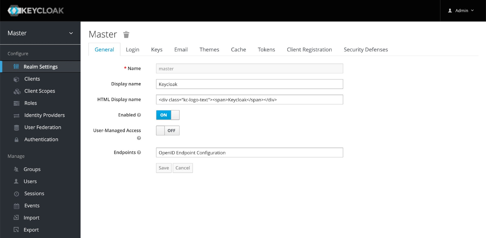

# springboot-keycloak-mongodb-testcontainers

The goals of this project are:

- Create a [`Spring Boot`](https://docs.spring.io/spring-boot/docs/current/reference/htmlsingle/) application that manages books, called `book-service`;
- Use [`Keycloak`](https://www.keycloak.org) as OpenID Connect Provider;
- Test using [`Testcontainers`](https://www.testcontainers.org/);
- Explore the utilities and annotations that `Spring Boot` provides when testing applications.

## Application

- ### book-service
  
  `Spring Boot` Web application that manages books. [`MongoDB`](https://www.mongodb.com) is used as storage, and the application's sensitive endpoints (like create, update and delete books) are secured.
  
  

## Prerequisites

- [`Java 17+`](https://www.oracle.com/java/technologies/downloads/#java17)
- [`Docker`](https://www.docker.com/)
- [`Docker-Compose`](https://docs.docker.com/compose/install/)
- [`jq`](https://stedolan.github.io/jq)

## Start Environment

- Open a terminal and inside `springboot-keycloak-mongodb-testcontainers` root folder run
  ```
  docker-compose up -d
  ```

- Wait for `keycloak` and `mongodb` Docker containers to be up and running. To check it, run
  ```
  docker-compose ps
  ```

## Configure Keycloak

There are two ways: running a script or using `Keycloak` website

### Running Script

- In a terminal, make sure you are in `springboot-keycloak-mongodb-testcontainers` root folder

- Run the following script to configure `Keycloak` for `book-service` application
  ```
  ./init-keycloak.sh
  ```

  This script creates:
  - `company-services` realm;
  - `book-service` client;
  - `manage_books` client role;
  - user with _username_ `ivan.franchin` and _password_ `123` and with the role `manage_books` assigned.

- The `book-service` client secret (`BOOK_SERVICE_CLIENT_SECRET`) is shown at the end of the execution. It will be used in the next step

- You can check the configuration in `Keycloak` by accessing http://localhost:8080. The credentials are `admin/admin`. 

### Using Keycloak Website



#### Login

- Access http://localhost:8080/admin

- Login with the credentials
  ```
  Username: admin
  Password: admin
  ```

#### Create a new Realm

- On the left menu, click the dropdown button that contains `Master` and then, click `Create Realm` button
- Set `company-services` to the `Realm name` field and click `Create` button

#### Create a new Client

- On the left menu, click `Clients`
- Click `Create client` button
- In `General Settings`
  - Set `book-service` to `Client ID`
  - Click `Next` button
- In `Capability config`
  - Enable `Client authentication` toggle switch
  - Click `Save` button
- In `Settings` tab
  - Set `http://localhost:9080/*` to `Valid Redirect URIs`
  - Click `Save` button
- In `Credentials` tab, you can find the secret generated for `book-service`
- In `Roles` tab
  - Click `Create Role` button
  - Set `manage_books` to `Role Name`
  - Click `Save` button

#### Create a new User

- On the left menu, click `Users`
- Click `Create new user` button
- Set `ivan.franchin` to `Username` field
- Click `Save`
- In `Credentials` tab
  - Click `Set password` button
  - Set the value `123` to `Password` and `Password confirmation`
  - Disable the `Temporary` field toggle switch
  - Click `Save` button
  - Confirm by clicking `Save Password` button
- In `Role Mappings` tab
  - Click `Assign role` button
  - Click `Filter by Origin` dropdown button and select `book-service`
  - Select `manage_books` role and click `Assign` button

## Running book-service with Gradle

- Open a new terminal and navigate to `springboot-keycloak-mongodb-testcontainers` root folder

- Run the following command to start the application
  ```
  ./gradlew book-service:clean book-service:bootRun --args='--server.port=9080'
  ```
  
- The application Swagger URL is http://localhost:9080/swagger-ui.html

## Getting Access Token

- Open a terminal and make sure you are in `springboot-keycloak-mongodb-testcontainers` root folder

- Create an environment variable that contains the `Client Secret` generated by `Keycloak` to `book-service` at [Configure Keycloak](#configure-keycloak) step
  ```
  BOOK_SERVICE_CLIENT_SECRET=...
  ```

- Run the commands below to get an access token for `ivan.franchin`
  ```
  ACCESS_TOKEN=$(./get-access-token.sh $BOOK_SERVICE_CLIENT_SECRET) && echo $ACCESS_TOKEN
  ```
  > **Note**: In [jwt.io](https://jwt.io), you can decode and verify the `JWT` access token

- The access token has a default expiration time of `5 minutes`

## Test using cURL

- In terminal, call the endpoint `GET /api/books`
  ```
  curl -i http://localhost:9080/api/books
  ```
  It should return:
  ```
  HTTP/1.1 200
  []
  ```

- Try to call the endpoint `POST /api/books`, without access token
  ```
  curl -i -X POST http://localhost:9080/api/books \
    -H "Content-Type: application/json" \
    -d '{"authorName": "Ivan Franchin", "title": "Java 8", "price": 10.5}'
  ```
  It should return:
  ```
  HTTP/1.1 401
  ```

- If you do not have the access token stored in `ACCESS_TOKEN` environment variable, get it by following the steps describe at [Getting Access Token](#getting-access-token)

- Call the endpoint `POST /api/books`, now informing the access token
  ```
  curl -i -X POST http://localhost:9080/api/books \
    -H "Authorization: Bearer $ACCESS_TOKEN" \
    -H "Content-Type: application/json" \
    -d '{"authorName": "Ivan Franchin", "title": "Java 8", "price": 10.5}'
  ```
  It should return something like
  ```
  HTTP/1.1 201
  {"id":"612f4f9438e39e473c4d098b", "authorName":"Ivan Franchin", "title":"Java 8", "price":10.5}
  ```

## Test using Swagger

- Access http://localhost:9080/swagger-ui.html

- Click `GET /api/books` to open it. Then, click `Try it out` button and, finally, click `Execute` button.

  It will return a http status code `200` and an empty list or a list with some books if you've already added them

- Now, let's try to call a secured endpoint without authentication. Click `POST /api/books` to open it. Then, click `Try it out` button (you can use the default values) and, finally, click `Execute` button.

  It will return
  ```
  Code: 401
  Details: Error: response status is 401
  ```

- Get the access token as explained at [Getting Access Token](#getting-access-token)

- Copy the token generated and go back to `Swagger`

- Click the `Authorize` button and paste the access token in the `Value` field. Then, click `Authorize` and, to finalize, click `Close`

- Go to `POST /api/books`, click `Try it out` and, finally, click `Execute` button.

  It should return something like
  ```
  HTTP/1.1 201
  {
    "id": "612f502f38e39e473c4d098c",
    "authorName": "Ivan Franchin",
    "title": "SpringBoot",
    "price": 10.5
  }
  ```

## Running book-service as a Docker Container

- In a terminal, navigate to `springboot-keycloak-mongodb-testcontainers` root folder

- Build Docker Image
  ```
  ./docker-build.sh
  ```
  | Environment Variable | Description                                                       |
  |----------------------|-------------------------------------------------------------------|
  | `MONGODB_HOST`       | Specify host of the `Mongo` database to use (default `localhost`) |
  | `MONGODB_PORT`       | Specify port of the `Mongo` database to use (default `27017`)     |
  | `KEYCLOAK_HOST`      | Specify host of the `Keycloak` to use (default `localhost`)       |
  | `KEYCLOAK_PORT`      | Specify port of the `Keycloak` to use (default `8080`)            |
  
- Run `book-service` docker container, joining it to docker-compose network
  ```
  docker run --rm --name book-service \
    -p 9080:8080 \
    -e MONGODB_HOST=mongodb \
    -e KEYCLOAK_HOST=keycloak \
    --network=springboot-keycloak-mongodb-testcontainers_default \
    ivanfranchin/book-service:1.0.0
  ```

- Open a new terminal and create an environment variable that contains the `Client Secret` generated by `Keycloak`
  ```
  BOOK_SERVICE_CLIENT_SECRET=...
  ```

- In order to get the access token from `Keycloak`, run the following commands
  ```
  ACCESS_TOKEN=$(./get-access-token.sh $BOOK_SERVICE_CLIENT_SECRET "keycloak:8080") && echo $ACCESS_TOKEN
  ```
  > **Note** 1: the `"keycloak:8080"` string is informed in the second argument of the script. It changes `"localhost:8080"` host/port inside the script. This way, we won't have the error complaining about an invalid token due to an invalid token issuer.
  > 
  > **Note** 2: In [jwt.io](https://jwt.io), you can decode and verify the `JWT` access token

- Test [using cURL](#test-using-curl) or [using Swagger](#test-using-swagger) as explained above

## Useful Links & Commands

- **MongoDB**

  List books
  ```
  docker exec -it mongodb mongosh bookdb
  db.books.find()
  ```
  > Type `exit` to get out of MongoDB shell

## Shutdown

- To stop `book-service`, go to the terminal where the application is running and press `Ctrl+C`
- To stop and remove docker-compose containers, networks and volumes, make sure you are in `springboot-keycloak-mongodb-testcontainers` and run
  ```
  docker-compose down -v
  ```

## Cleanup

To remove the Docker image created by this project, go to a terminal and, inside `springboot-keycloak-mongodb-testcontainers` root folder, run the following script
```
./remove-docker-images.sh
```

## Running Unit and Integration Tests

- In a terminal and inside `springboot-keycloak-mongodb-testcontainers` root folder, run the command below to run unit and integration tests
  ```
  ./gradlew book-service:clean book-service:assemble \
    book-service:cleanTest \
    book-service:test \
    book-service:integrationTest
  ```
  > **Note**: During integration tests, `Testcontainers` will start automatically `MongoDB` and `Keycloak` containers before the tests begin and shuts them down when the tests finish.

- From `springboot-keycloak-mongodb-testcontainers` root folder, **Unit Testing Report** can be found at
  ```
  book-service/build/reports/tests/test/index.html
  ```
  
- From `springboot-keycloak-mongodb-testcontainers` root folder, **Integration Testing Report** can be found at
  ```
  book-service/build/reports/tests/integrationTest/index.html
  ```

## References

- https://docs.spring.io/spring-boot/docs/current/reference/html/boot-features-testing.html
