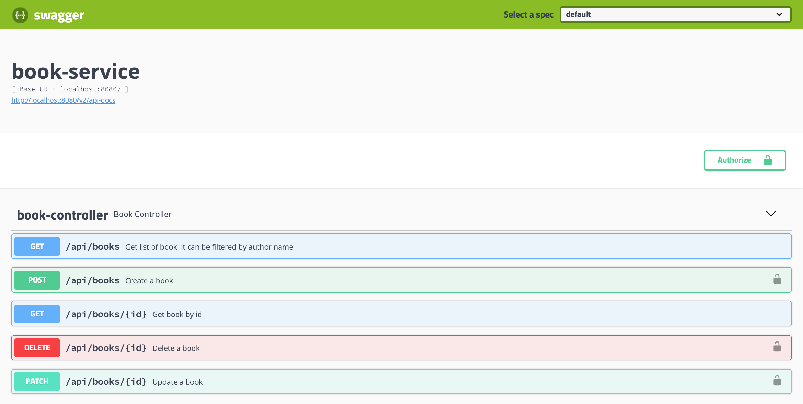

# `springboot-testing-mongodb-keycloak`

The goals of this project are:

- Create a [`Spring Boot`](https://docs.spring.io/spring-boot/docs/current/reference/htmlsingle/) Web application that
manages books, called `book-service`. The data is stored in [`MongoDB`](https://www.mongodb.com). The application will
have its sensitive endpoints (add/update/delete book) secured.
- Use [`Keycloak`](https://www.keycloak.org) as authentication and authorization server;
- Explore the utilities and annotations that `Spring Boot` provides when testing applications.

> Note. In the [`Kubernetes Environment`](https://github.com/ivangfr/kubernetes-environment) repository, it is shown how
to deploy this project in Kubernetes (Minikube)

## Build Docker Image

In a terminal and inside `springboot-testing-mongodb-keycloak` root folder, run the following command to build
`book-service` docker image
```
./gradlew book-service:clean book-service:build book-service:docker -x test -x integrationTest
```
| Environment Variable | Description                                                       |
| -------------------- | ----------------------------------------------------------------- |
| `MONGODB_HOST`       | Specify host of the `Mongo` database to use (default `localhost`) |
| `MONGODB_PORT`       | Specify port of the `Mongo` database to use (default `27017`)     |
| `KEYCLOAK_HOST`      | Specify host of the `Keycloak` to use (default `localhost`)       |
| `KEYCLOAK_PORT`      | Specify port of the `Keycloak` to use (default `8080`)            |

## Start Environment

Open a terminal and inside `springboot-testing-mongodb-keycloak` root folder run
```
docker-compose up -d
```

Wait a little bit until all containers are `Up (healthy)`. You can check their status by running
```
docker-compose ps
```

## Configure Keycloak

There are two ways to configure `Keycloak`: automatically running a script or manually using `Keycloak UI`.

### Automatically running script

1. In a terminal and inside `springboot-testing-mongodb-keycloak` root folder, run the following script to initialize
`Keycloak`.
```
./init-keycloak.sh
```
> This script creates automatically `company-services` realm, `book-service` client, `manage_books` client role and
the user `ivan.franchin` with the role `manage_books` assigned.

2. `BOOKSERVICE_CLIENT_SECRET` value is shown at the end of the script outputs. It will be needed whenever we call
`Keycloak` to get token for the `book-service` application.

### Manually using Keycloak UI


#### Login

- Access http://localhost:8080/auth/admin/master/console
- Login with the credentials
```
Username: admin
Password: admin
```

#### Create a new Realm

- Go to top-left corner and hover the mouse over `Master` realm. A blue button `Add realm` will appear. Click on it.
- On `Name` field, write `company-services`. Click on `Create`.

#### Create a new Client

- Click on `Clients` menu on the left.
- Click `Create` button.
- On `Client ID` field type `book-service`.
- Click on `Save`.
- On `Settings` tab, set the `Access Type` to `confidential`.
- Still on `Settings` tab, set the `Valid Redirect URIs` to `http://localhost:8080/*`.
- Click on `Save`.
- Go to `Credentials` tab. Copy the value on `Secret` field. It will be used on the next steps.
- Go to `Roles` tab.
- Click `Add Role` button.
- On `Role Name` type `manage_books`.
- Click on `Save`.

#### Create a new User

- Click on `Users` menu on the left.
- Click on `Add User` button.
- On `Username` field set `ivan.franchin`.
- Click on `Save`.
- Go to `Credentials` tab.
- Set to `New Password` and `Password Confirmation` the value `123`.
- Turn off the `Temporary` field.
- Click on `Reset password`.
- Confirm the pop up clicking on `Change Password`.
- Go to `Role Mappings` tab.
- Select `book-service` on the combo-box `Client Roles`.
- Add the role `manage_books` to `ivan.franchin`. 

## Getting Access Token

1. In a terminal, export to an environment variable the `Secret` generated by `Keycloak` to `book-service`.
See [Configure Keycloak](https://github.com/ivangfr/springboot-testing-mongodb-keycloak#configure-keycloak)
```
export BOOKSERVICE_CLIENT_SECRET=...
```

2. Run the script below to get an access token for `ivan.franchin` user
```
BEARER_MY_ACCESS_TOKEN=$(./get-access-token.sh $BOOKSERVICE_CLIENT_SECRET)
```

3. Check the access token returned
```
echo $BEARER_MY_ACCESS_TOKEN
```

4. The access token has a default expiration time of `5 minutes`

## Test using cURL

1. In terminal, call the endpoint `GET /api/books`
```
curl -i http://localhost:9080/api/books
```

It will return:
```
HTTP/1.1 200
[]
```

2. Try to call the endpoint `POST /api/books`, without access token
```
curl -i -X POST http://localhost:9080/api/books \
  -H "Content-Type: application/json" \
  -d '{ "authorName": "ivan", "title": "java 8", "price": 10.5 }'
```
It will return:
```
HTTP/1.1 302
```

3. If you do not have the access token stored in `BEARER_MY_ACCESS_TOKEN` environment variable, get it by following the
steps describe at [Getting Access Token](https://github.com/ivangfr/springboot-testing-mongodb-keycloak#getting-access-token)

4. Call the endpoint `POST /api/books`, now informing the access token
```
curl -i -X POST http://localhost:9080/api/books \
  -H "Authorization: $BEARER_MY_ACCESS_TOKEN" \
  -H "Content-Type: application/json" \
  -d '{ "authorName": "ivan", "title": "java 8", "price": 10.5 }'
```

It will return something like
```
HTTP/1.1 201
{
  "id":"01d984be-26bc-49f5-a201-602293d62b82",
  "authorName":"ivan",
  "title":"java 8",
  "price":10.5
}
```

## Test using Swagger



1. Access http://localhost:9080/swagger-ui.html

2. Click on `GET /api/books` to open it. Then, click on `Try it out` button and, finally, click on `Execute` button.
It will return a http status code `200` and an empty list or a list with some books if you've already added them.

3. Now, let's try to call a secured endpoint without authentication. Click on `POST /api/books` to open it. Then, click
on `Try it out` button (you can use the default values) and, finally, on `Execute` button. It will return:
```
TypeError: Failed to fetch
```

4. Get the access token as explained at [Getting Access Token](https://github.com/ivangfr/springboot-testing-mongodb-keycloak#getting-access-token)

5. Copy the token generated (something like that starts with `Bearer ...`) and go back to `Swagger`.

6. Click on the `Authorize` button and paste access token (copied previously) in the value field. Then, click on
`Authorize` and, to finalize, click on `Close`.

7. Go to `POST /api/books`, click on `Try it out` and then on `Execute` button. It will return something like
```
HTTP/1.1 201
{
  "id": "5cf212c3-7902-4141-968b-82ae7a3443f1",
  "authorName": "Craig Walls",
  "title": "Spring Boot",
  "price": 10.5
}
```

## Running book-service with Gradle

During development, it is easier to just run the application instead of always build the docker image before running
it. In order to do that, comment `book-service` in `docker-compose.yml` file (so that it does not start when you start
the environment) and run it with `Gradle`.

1. Open a terminal and inside `springboot-testing-mongodb-keycloak` root folder, start the application by running
```
./gradlew book-service:clean book-service:bootRun -Dserver.port=9080
```

2. Export to `BOOKSERVICE_CLIENT_SECRET`, the `Client Secret` generated by `Keycloak`
```
export BOOKSERVICE_CLIENT_SECRET=...
```

3. In order to get the access token from `Keycloak`, run the following command. Note that we are informing `localhost`
in the second argument. It changes `Keycloak` host inside the script.
```
BEARER_MY_ACCESS_TOKEN=$(./get-access-token.sh $BOOKSERVICE_CLIENT_SECRET localhost)
echo $BEARER_MY_ACCESS_TOKEN
```

4. Test using cURL or Swagger are the same as explained above.

## Shutdown

To stop and remove containers, networks and volumes, run
```
docker-compose down -v
```

## Running unit and integration testing

In a terminal and inside `springboot-testing-mongodb-keycloak` root folder, run the command below to run unit and
integration tests
```
./gradlew book-service:cleanTest book-service:test book-service:integrationTest
```

- From `springboot-testing-mongodb-keycloak` root folder, **Unit Testing Report** can be found at
```
book-service/build/reports/tests/test/index.html
```
- From `springboot-testing-mongodb-keycloak` root folder, **Integration Testing Report** can be found at
```
book-service/build/reports/tests/integrationTest/index.html
```

## Useful Links/Commands

### MongoDB

List all books in `MongoDB`
```
docker exec -it mongodb mongo
use bookdb
db.book.find()
```

### jwt.io

With [jwt.io](https://jwt.io) you can inform the JWT token received from `Keycloak` and the online tool decodes the
token, showing its header and payload.

## References

- https://docs.spring.io/spring-boot/docs/current/reference/html/boot-features-testing.html
- http://www.baeldung.com/spring-boot-testing

## Issues

- During the startup, there is a warning presented below. It seems to be a `spring-data-mongo` problem
(https://github.com/aidanwhiteley/books/issues/86)
```
WARN 3450 --- [           main] o.s.data.convert.CustomConversions       : Registering converter from class java.time.LocalDateTime to class java.time.Instant as reading converter although it doesn't convert from a store-supported type! You might wanna check you annotation setup at the converter implementation.
WARN 3450 --- [           main] o.s.data.convert.CustomConversions       : Registering converter from class java.time.Instant to class java.time.LocalDateTime as reading converter although it doesn't convert from a store-supported type! You might wanna check you annotation setup at the converter implementation.
```

